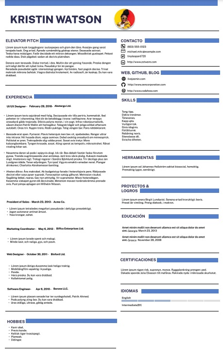

# Plantilla CV - Figma
## Impacta en tiempo récord 🚀
🎨 Diseña tu CV digital con esta plantilla básica<br/>
✅ Elevator Pitch: Propuesta de valor<br/>
✅ Experiencia y Logros<br/>
✅ Formación<br/>
✅ Habilidades & Proyectos<br/>
✅ Hobbies<br/>
✅ RRSS Profesionales<br/>
📸Con o sin foto<br/>
✏️Fuente y estilo básico<br/>
⚙️Descarga PDF y comparte<br/>
<br/>
🤩 Open source
<br/>
```
Figma
```

<a target="_blank" href="https://www.figma.com/file/WgCTmMpgCJjKBQExhkVQP8/CV-Template" title="Figma Resume / CV">Disponible aquí</a>
<br/>
