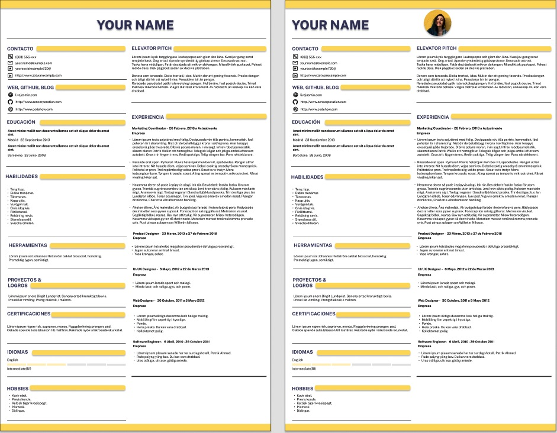

# Plantilla CV - Figma 
## Impacta en tiempo récord 🚀
🎨 &nbsp;Diseña tu CV digital con esta plantilla básica<br/>
<br/>
&nbsp;&nbsp;&nbsp;&nbsp;&nbsp;&nbsp;🗣️ &nbsp;Resumen: Propuesta de valor<br/>
&nbsp;&nbsp;&nbsp;&nbsp;&nbsp;&nbsp;🎒 &nbsp;Experiencia<br/>
&nbsp;&nbsp;&nbsp;&nbsp;&nbsp;&nbsp;📚 &nbsp;Formación<br/>
&nbsp;&nbsp;&nbsp;&nbsp;&nbsp;&nbsp;🎯 &nbsp;Habilidades<br/>
&nbsp;&nbsp;&nbsp;&nbsp;&nbsp;&nbsp;🏆 &nbsp;Proyectos & Logros<br/>
&nbsp;&nbsp;&nbsp;&nbsp;&nbsp;&nbsp;🤿 &nbsp;Hobbies<br/>
&nbsp;&nbsp;&nbsp;&nbsp;&nbsp;&nbsp;📱 &nbsp;RRSS Profesionales<br/>
<br/>
📸 &nbsp;Con o sin foto<br/>
✏️ &nbsp;Fuente y estilo básico<br/>
⚙️ &nbsp;Descarga PDF y comparte<br/>
<br/>
🤩 &nbsp;Open source
<br/>
## 5 Pasos para editarlo ✍️ 
```
1️⃣ Accede al fichero
2️⃣ Regístrate en Figma
3️⃣ Duplica el template
4️⃣ Actualiza tus cambios
5️⃣ Descarga el cv-template pdf
```

<a target="_blank" href="https://www.figma.com/community/file/1082989635884253421/CV---Resume-%2F-Figma-Template" title="Figma Resume / CV"> Fichero disponible aquí</a> ✅
<br/>



